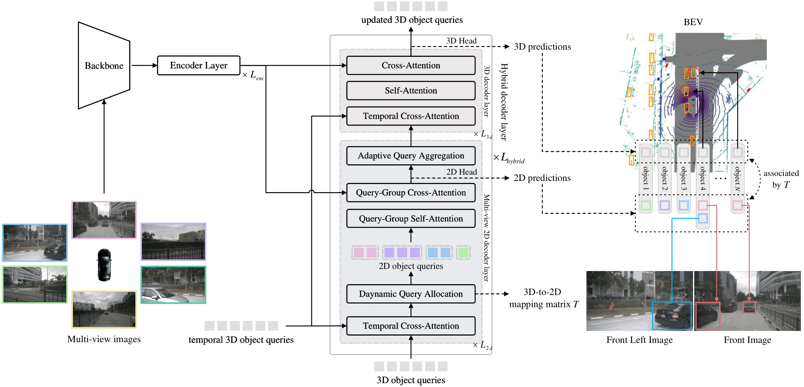

<div align="center">
<h1>SimPB</h1>
<h3> [ECCV 2024] SimPB: A Single Model for 2D and 3D Object Detection from Multiple Cameras </h3>
 
[](https://arxiv.org/abs/2403.10353)

</div>



## Introduction
This repository is an official implementation of *SimPB*, which **Sim**ultaneously detects 2D objects in the
**P**erspective view and 3D objects in the **B**EV space from multiple cameras.


## Getting started
- [Prepare Environment](docs/prepare_environment.md) 
- [Prepare Dataset](docs/prepare_dataset.md)
- [Training and Evaluation](docs/training_evaluation.md)

## Model Zoo

**Results on NuScenes validation**

| method  | backbone  |                               pretrain                                | img size |  mAP  |  NDS  |                             config                             | ckpt | log |
|:-------:|:---------:|:---------------------------------------------------------------------:|:--------:|:-----:|:-----:|:--------------------------------------------------------------:|:----:|:---:|
| SimPB+  | ResNet50  | [ImageNet](https://download.pytorch.org/models/resnet50-19c8e357.pth) | 704x256  | 0.479 | 0.586 | [config](projects/configs/simpb_nus_r50_img_704x256.py)  | [ckpt](https://github.com/nullmax-vision/SimPB/releases/download/weights/simpb_r50_img.pth)     | [log](https://github.com/nullmax-vision/SimPB/releases/download/weights/simpb_r50_img.log)    |
| SimPB+  | ResNet50  |                               [nuImg](https://download.openmmlab.com/mmdetection3d/v0.1.0_models/nuimages_semseg/cascade_mask_rcnn_r50_fpn_coco-20e_20e_nuim/cascade_mask_rcnn_r50_fpn_coco-20e_20e_nuim_20201009_124951-40963960.pth)                               | 704x256  | 0.489 | 0.591 | [config](projects/configs/simpb_nus_r50_uimg_704x256.py)  | [ckpt](https://github.com/nullmax-vision/SimPB/releases/download/weights/simpb_r50_uimg.pth)     | [log](https://github.com/nullmax-vision/SimPB/releases/download/weights/simpb_r50_uimg.log)    |
|  SimPB  | ResNet101 |                                 nuImg                                 | 1408x512 | 0.539 | 0.629 | |      |     | 

Note: SimPB+ is a modified architecture that introduces 2d denoise and removes the encoder. This slightly reduces the runtime while maintaining comparable performance compared to the released script.

## Acknowledgement
Thanks to these excellent open-source works:

[Sparse4Dv3](https://github.com/HorizonRobotics/Sparse4D),
[StreamPETR](https://github.com/exiawsh/StreamPETR),
[SparseBEV](https://github.com/MCG-NJU/SparseBEV),
[Far3D](https://github.com/megvii-research/Far3D),
[MMDetection3D](https://github.com/open-mmlab/mmdetection3d)

## Citation
```bibtex
 @article{simpb,
  title={SimPB: A Single Model for 2D and 3D Object Detection from Multiple Cameras},
  author={Yingqi Tang and Zhaotie Meng and Guoliang Chen and Erkang Cheng},
  journal={ECCV},
  year={2024}
}
```